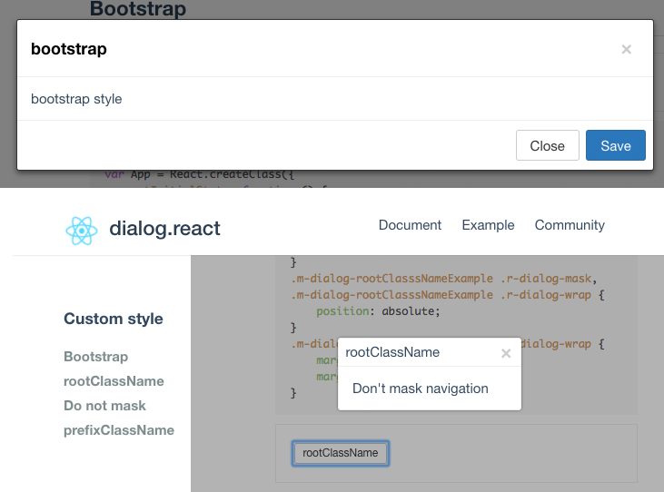

# dialog.react

> React,Dialog.Custom style!

[](https://travis-ci.org/fast-flow/dialog.react)
[](https://npmjs.org/package/dialog.react)
[](https://npmjs.org/package/dialog.react)


## Install

```shell
npm install dialog.react --save
```

## Example

[](http://fast-flow.github.io/dialog.react/example)

## Online documentation

[Online](http://fast-flow.github.io/dialog.react)

## Change log

[CHANGELOG](./CHANGELOG.md)


## To be solved

- [ ] In extreme cases `props.showBodyStyle` conflict
- [ ] Unrealized `props.maskAlwaysShow` 利用一个数组保存当前显示的 dialog 记录，然后决定最底层还是最上层的dialog需要显示遮罩
